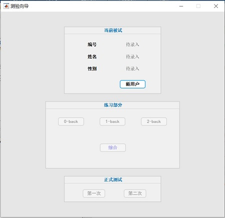
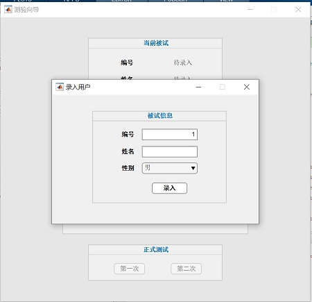

# N-Back Test

The classical cognitive psychological test: n-back paradigm.

## Motivation

We are planning for a cognitive training project, which contains an fMRI pre-test and an fMRI post-test with the same test paradigm: **n back test**. Based on the previous experience, we decided to use [**Psychtoolbox**](https://github.com/Psychtoolbox-3/Psychtoolbox-3) to program the stimuli presentation process. We use **Github** to host our codes for this test.

## Usage

It is easy to use these codes to start an experiment. Simply start a `MATLAB` (please use the latest version, or at least version larger than `R2017b`) session, and type

```matlab
start_exp
```

then a graphical user interface (GUI) called **测验向导** will appear (see below).



With this GUI, you can add and modify user, start practice and testing part of experiment. Especially when you click on **新用户**, a user register wizard will pop up:



## Contributing

Pull request or issue opening are welcome.

## Authors

* Liang Zhang ([psychelzh](https://github.com/psychelzh)) - main coding part
* Yu Zhou ([Zhouyu0206](https://github.com/Zhouyu0206)) - instruction pictures
* Peixuan Li ([Flowshadow](https://github.com/Flowshadow)) - pictures in older versions

See also the list of [contributors](https://github.com/psychelzh/n-back-child/graphs/contributors) who participated in the project.

## License

This project is licensed under the MIT license. See [LICENSE.md](LICENSE.md) for details.

## Acknowledgement

* Chuqi Liu - suggestions in the fMRI pilot.
